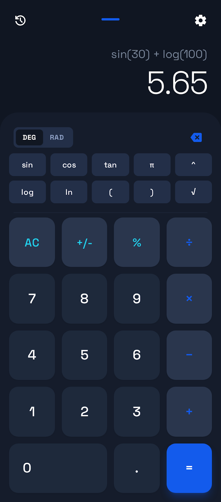

# 🧮 Engineering Calculator Web App


모던하고 직관적인 UI/UX를 갖춘 공학용 전자계산기 웹 애플리케이션




## ✨ 주요 기능

- ✅ **기본 산술 연산**: 사칙연산, 백분율, 부호 변경
- ✅ **과학 함수**: sin, cos, tan, log, ln, 거듭제곱, 제곱근, π
- ✅ **각도 모드**: DEG/RAD 전환
- ✅ **계산 기록**: 이전 계산 조회 및 재사용
- ✅ **다크/라이트 모드**: 테마 전환
- ✅ **반응형 디자인**: 모바일, 태블릿, 데스크톱 지원

## 🏛️ 개발 원칙

이 프로젝트는 다음 핵심 원칙을 따릅니다:

### 🧪 TDD (Test-Driven Development)
- **UI를 제외한 모든 코어 로직은 TDD로 구현**
- Red-Green-Refactor 사이클 준수
- 코어 로직 100% 테스트 커버리지 목표

### 🏛️ SOLID 원칙
- **S**ingle Responsibility: 단일 책임 원칙
- **O**pen/Closed: 개방-폐쇄 원칙
- **L**iskov Substitution: 리스코프 치환 원칙
- **I**nterface Segregation: 인터페이스 분리 원칙
- **D**ependency Inversion: 의존성 역전 원칙

자세한 내용은 [DEVELOPMENT_GUIDE.md](./DEVELOPMENT_GUIDE.md)를 참조하세요.


## 🚀 빠른 시작

### 로컬 개발 환경 설정

1. 저장소 클론
```bash
git clone https://github.com/YOUR_USERNAME/calculator-demo.git
cd calculator-demo
```

2. 의존성 설치
```bash
npm install
```

3. 테스트 실행
```bash
npm test              # 모든 테스트 실행
npm run test:watch    # Watch 모드로 테스트
npm run test:coverage # 커버리지 리포트 생성
```

4. 개발 서버 실행
```bash
npm run dev           # Vite 개발 서버 (향후)
# 또는 VS Code Live Server 사용
```


### GitHub Pages 배포

1. Repository Settings > Pages로 이동
2. Source: **GitHub Actions** 선택
3. `main` 브랜치에 푸시하면 자동 배포

배포된 사이트: `https://YOUR_USERNAME.github.io/calculator-demo/`

## 🛠️ 기술 스택

- **HTML5**: 시맨틱 마크업
- **Tailwind CSS**: 유틸리티 우선 CSS 프레임워크
- **Vanilla JavaScript**: 프레임워크 없는 순수 JS
- **Math.js**: 정확한 수학 계산 엔진
- **GitHub Actions**: CI/CD
- **GitHub Pages**: 호스팅

자세한 내용은 [TECH_STACK.md](./TECH_STACK.md)를 참조하세요.

## 📋 프로젝트 문서

- [PRD.md](./PRD.md) - Product Requirements Document
- [TECH_STACK.md](./TECH_STACK.md) - 기술 스택 문서
- [DEVELOPMENT_GUIDE.md](./DEVELOPMENT_GUIDE.md) - 개발 가이드 (TDD & SOLID)


## 🏗️ 프로젝트 구조

```
calculator-demo/
├── index.html              # 메인 HTML 파일
├── css/
│   └── custom.css          # 커스텀 CSS
├── js/
│   ├── main.js             # 앱 진입점
│   ├── calculator.js       # 계산 로직
│   ├── ui.js               # UI 렌더링
│   └── storage.js          # LocalStorage 관리
├── .github/
│   └── workflows/
│       └── deploy.yml      # GitHub Actions 워크플로우
├── docs/
│   ├── design/             # 디자인 참고 자료
│   │   ├── code.html       # 디자인 HTML
│   │   └── screen.png      # 디자인 스크린샷
│   ├── PRD.md
│   ├── TECH_STACK.md
│   └── DEVELOPMENT_GUIDE.md
└── tests/                  # 테스트 파일
```


## 🎨 디자인

- **폰트**: Space Grotesk, Noto Sans
- **아이콘**: Material Symbols Outlined
- **색상**: 
  - Primary: `#135bec`
  - Background (Dark): `#101622`
  - Surface (Dark): `#1e293b`

## 🧪 개발 로드맵

- [x] PRD 작성
- [x] Tech Stack 정의
- [x] GitHub Actions 워크플로우 설정
- [ ] HTML 구조 구현
- [ ] CSS 스타일링
- [ ] JavaScript 로직 구현
- [ ] 테스트 작성
- [ ] 배포

## 📄 라이선스

MIT License

## 👨‍💻 개발자

개발 문의: [GitHub Issues](https://github.com/YOUR_USERNAME/calculator-demo/issues)

---

**Made with ❤️ using Vanilla JavaScript**
