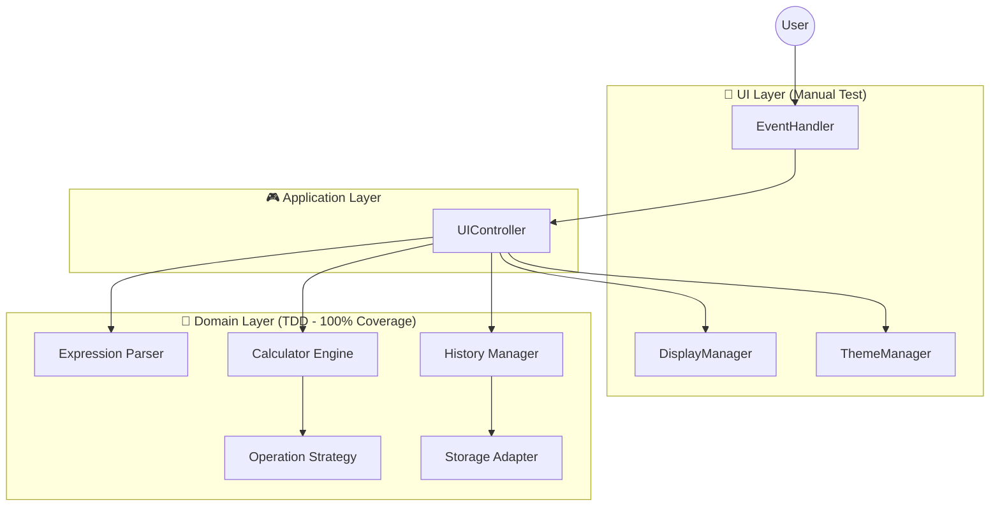

# 🧮 Modern Engineering Calculator

> **TDD와 SOLID 원칙을 기반으로 설계된 모던 웹 공학용 계산기**


<p align="center">
  
</p>

## 📖 프로젝트 소개

이 프로젝트는 단순한 기능 구현을 넘어, **견고한 소프트웨어 아키텍처**와 **엔지니어링 원칙**을 웹 프론트엔드 개발에 적용하는 것을 목표로 했습니다. DOM을 직접 제어하는 **Vanilla JavaScript** 환경에서도 컴포넌트 기반 아키텍처와 관심사의 분리(SoC)를 달성할 수 있음을 증명하고자 했습니다.

### 핵심 목표
- **Test-Driven Development (TDD)**: 코어 로직의 안정성 보장 및 100% 테스트 커버리지 달성
- **SOLID Principles**: 유지보수성 높고 확장이 용이한 객체지향 설계 적용
- **Framework-less Architecture**: 프레임워크 없이 순수 JS로 상태 관리 및 UI 렌더링 시스템 구현

## ✨ 주요 기능

| 분류 | 기능 | 설명 |
|------|------|------|
| **기본 연산** | 사칙연산, %, +/- | 표준 연산 우선순위 처리 및 백분율 계산 |
| **공학 연산** | 삼각함수, 로그, 지수 | sin, cos, tan, log, ln, 제곱근 등 고급 함수 지원 |
| **사용성** | 각도 모드, 기록 관리 | DEG/RAD 전환 및 이전 계산 기록 재사용 기능 |
| **UI/UX** | 다크모드, 반응형 | 모바일 우선 설계 및 시스템 테마 연동 다크모드 |

## 🏗️ 시스템 아키텍처

이 애플리케이션은 **MVC (Model-View-Controller)** 패턴을 변형한 **Layered Architecture**를 따릅니다. UI와 비즈니스 로직을 철저히 분리하여 테스트 용이성을 확보했습니다.



### 아키텍처 특징
1. **Domain Layer (Core)**: 
   - 외부 의존성(DOM, Web API)이 전혀 없는 순수 함수/클래스로 구성
   - Jest를 이용해 100% 테스트 커버리지로 보호됨
   - 복잡한 수식 파싱과 계산 로직을 담당

2. **Application Layer**:
   - UI 이벤트와 도메인 로직을 연결하는 중재자 역할
   - 상태 관리를 담당하며 UI 업데이트를 트리거함

3. **UI Layer**:
   - DOM 조작과 이벤트 리스닝만 담당
   - 로직을 포함하지 않아 수동 테스트만으로 충분하도록 설계

## 👨‍💻 기술적 우수성 & 엔지니어링

이 프로젝트는 다음과 같은 소프트웨어 공학 원칙을 실제로 적용했습니다. 상세한 내용은 [DEVELOPMENT_GUIDE.md](./DEVELOPMENT_GUIDE.md)에서 확인할 수 있습니다.

### 1. TDD (Test-Driven Development) 실천
모든 코어 로직은 **Red-Green-Refactor** 사이클을 통해 개발되었습니다.
- **안정성**: 수식 파서와 계산 엔진의 모든 엣지 케이스(Edge case)를 테스트로 검증했습니다.
- **문서화**: 테스트 코드가 그 자체로 살아있는 명세서 역할을 합니다.

### 2. SOLID 원칙 적용 사례
- **OCP (Open/Closed Principle)**: 새로운 연산자를 추가할 때, 기존 `Calculator` 코드를 수정하지 않고 `Operation` 인터페이스를 구현한 새 클래스를 등록하는 방식으로 확장 가능합니다.
- **DIP (Dependency Inversion Principle)**: `Calculator`는 구체적인 `LocalStorage`가 아닌 `StorageInterface`에 의존하여, 저장소 구현체가 변경되어도 핵심 로직은 영향을 받지 않습니다.

### 3. Framework-less Component Design
React나 Vue 같은 프레임워크 없이도 모듈화된 설계를 구현했습니다.
- **State Management**: 옵저버 패턴을 활용한 상태 변경 감지 및 UI 업데이트
- **Event Delegation**: 이벤트 위임 패턴을 사용하여 메모리 사용 최적화

## 🛠️ 기술 스택 (Tech Stack)

- **Language**: JavaScript (ES6+), HTML5, CSS3
- **Styling**: Tailwind CSS (Utility-first approach)
- **Testing**: Jest (Unit & Integration Testing)
- **Math Engine**: math.js (High precision calculation)
- **CI/CD**: GitHub Actions, GitHub Pages
- **Tools**: ESLint, Prettier, Vite (planned)

## 🚀 시작하기 (Getting Started)

### 사전 요구사항
- Node.js 18.0.0 이상
- npm 9.0.0 이상

### 설치 및 실행

1. **저장소 클론**
   ```bash
   git clone https://github.com/YOUR_USERNAME/calculator-demo.git
   cd calculator-demo
   ```

2. **의존성 설치**
   ```bash
   npm install
   ```

3. **테스트 실행 (TDD 검증)**
   ```bash
   npm test               # 전체 테스트 실행
   npm run test:coverage  # 커버리지 리포트 확인
   ```

4. **개발 서버 실행**
   ```bash
   # VS Code의 'Live Server' 확장을 사용하거나
   # Vite 설정 후: npm run dev
   ```

## 📂 프로젝트 문서
- [📈 PRD (요구사항 정의서)](./PRD.md)
- [🏗️ Tech Stack (기술 스택 문서)](./TECH_STACK.md)
- [📏 Development Guide (개발 가이드)](./DEVELOPMENT_GUIDE.md)

## 🤝 기여하기
이 프로젝트는 오픈 소스입니다. 버그 리포트나 기능 제안은 Issue를 통해 환영합니다.

---
**Developed by [Your Name]**  
*Computer Science Stduent aspiring to build robust software.*
